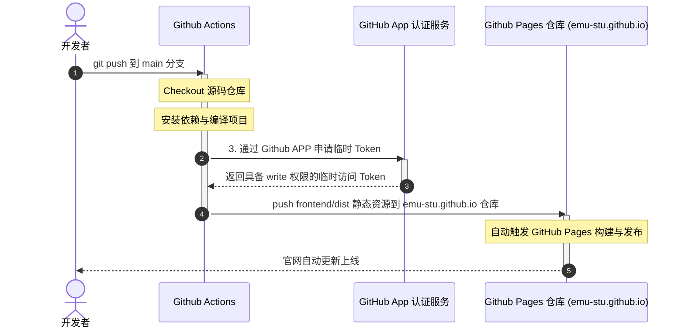

# EMU-Stu-Site

应急管理大学开源技术组织（EMU-Stu）源码网站仓库。

## 项目结构

```
EMU-Stu-Site/
├── frontend/              # 前端项目（Web Components + TS + Tailwind CSS）
│   ├── src/
│   │   ├── components/    # Web Components 组件
│   │   ├── config/        # 主题配置 & 项目常量配置
│   │   ├── styles/        # 全局样式
│   │   └── types/         # TypeScript 类型定义
│   ├── index.html         # 入口 HTML
│   ├── package.json
│   ├── tsconfig.json
│   ├── tailwind.config.ts
│   └── vite.config.ts
└── backend/               # 后端项目（WIP）
```

## 技术栈

### 前端

- **Web Components** — 原生组件化，无框架依赖
- **TypeScript** — 类型安全
- **Tailwind CSS v3** — 实用优先 CSS
- **Vite** — 构建工具 & 开发服务器

### 后端

- 待定

## 快速开始

### 前端开发

```bash
cd frontend
npm install
npm run dev      # 启动开发服务器（端口 3000）
npm run build    # 生产构建
npm run preview  # 预览生产构建
```

## 组件列表

| 组件 | 文件 | 说明 |
|------|------|------|
| `<emu-header>` | `emu-header.ts` | 顶部导航栏 |
| `<emu-hero>` | `emu-hero.ts` | 主视觉横幅 |
| `<emu-services>` | `emu-services.ts` | 校园服务网格与卡片 |
| `<emu-projects>` | `emu-projects.ts` | 开源项目展示 |
| `<emu-labs>` | `emu-labs.ts` | 实验室介绍展示组件 |
| `<emu-blog>` | `emu-blog.ts` | 技术博客展示组件 |
| `<emu-footer>` | `emu-footer.ts` | 页脚 |

## 自动化部署 (CI/CD)

本仓库采用 GitHub Actions 实现了**本地构建并直接跨仓库部署**。当开发者向本仓库（`emu-stu-site`）的 `main` 分支推送代码时，工作流会在当前仓库的运行机上完成编译，然后直接将静态网页文件推送到 `emu-stu.github.io` 官网仓库进行发布。

### 部署原理图



### 运行机制说明

1. **工作流收口**:
   所有的构建、编译和部署逻辑全部写在当前仓库的 [`.github/workflows/deploy.yml`] 中，Github Pages 仓库（`emu-stu.github.io`）不需要配置和管理任何 CI/CD 工作流文件。
2. **跨仓库安全推送**:
   在构建打包完成后，工作流使用 GitHub App 凭证动态生成具备网页仓库写权限的临时访问 Token，然后直接将打包生成的 `frontend/dist` 静态资源推送到 Github Pages 仓库的 `main` 分支。
