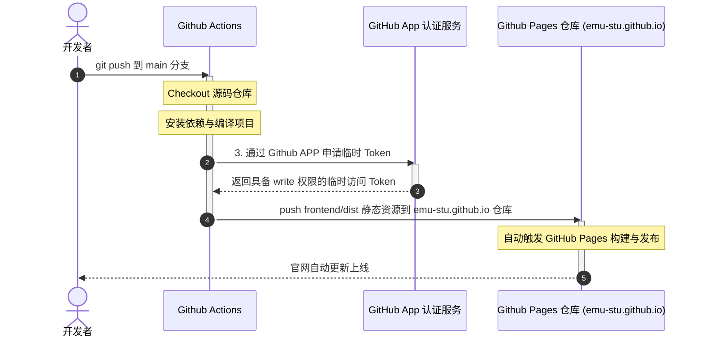

# EMU-Stu-Site

应急管理大学开源技术组织（EMU-Stu）源码网站仓库。

## 项目结构

```text
EMU-Stu-Site/
├── frontend/              # 前端项目
│   ├── src/
│   │   ├── components/    # 页面中使用的 Web Components 组件
│   │   ├── config/        # 主题与博客等常量配置
│   │   ├── styles/        # 全局与组件样式
│   │   └── types/         # TypeScript 类型声明
│   ├── index.html         # 单页入口
│   ├── package.json
│   ├── tsconfig.json
│   ├── tailwind.config.ts
│   └── vite.config.ts
├── script/                # 数据处理或统计脚本
└── backend/               # 后端项目（WIP）
```

## 技术栈

- **Web Components** - 采用原生 Custom Elements 规范，不依赖前端框架
- **TypeScript** - 强类型约束
- **Tailwind CSS v3** - 样式快速构建
- **Vite** - 本地开发服务器与构建工具

## 本地开发

运行前请确保本地已安装 Node.js。

```bash
cd frontend
npm install
npm run dev      # 启动本地开发服务
npm run build    # 打包静态资源
```

## 主要组件

| 组件标签 | 对应文件 | 功能描述 |
|------|------|------|
| `<emu-header>` | `emu-header.ts` | 顶部导航栏 |
| `<emu-hero>` | `emu-hero.ts` | 首页大图横幅 |
| `<emu-services>` | `emu-services.ts` | 服务卡片展示网格 |
| `<emu-projects>` | `emu-projects.ts` | 开源项目卡片列表 |
| `<emu-labs>` | `emu-labs.ts` | 实验室介绍展示 |
| `<emu-blog>` | `emu-blog.ts` | 博客文章列表与展示 |
| `<emu-article>` | `emu-article.ts` | 文章内容渲染容器 |
| `<emu-lightbox>` | `emu-lightbox.ts` | 图片放大预览灯箱 |
| `<emu-float>` | `emu-float.ts` | 通用悬浮/弹窗组件 |
| `<emu-tooltip>` | `emu-tooltip.ts` | 气泡提示，支持手动控制与边缘避让 |
| `<emu-contribution-heatmap>` | `emu-contribution-heatmap.ts` | 代码提交热力图，支持移动端长按滚动与点击穿透 |
| `<emu-easter-egg>` | `emu-easter-egg.ts` | 隐藏彩蛋逻辑 |
| `<emu-footer>` | `emu-footer.ts` | 底部版权与链接 |

## 自动部署

本项目使用 GitHub Actions 自动编译并发布。当代码合并入 `main` 分支时，工作流会完成编译，并将打包后的 `dist` 目录推送到静态网站托管仓库 [emu-stu.github.io](https://github.com/EMU-Stu/emu-stu.github.io)。

### 部署流程



### 运行机制说明

- **流程统一托管**：所有的构建与推送代码在当前仓库的 `.github/workflows/deploy.yml` 维护。目标部署仓库无需额外配置工作流。
- **无感秘钥授权**：推送时通过 GitHub App 动态申请临时的写权限 Token，不需要配置长期有效的个人 Access Token。
