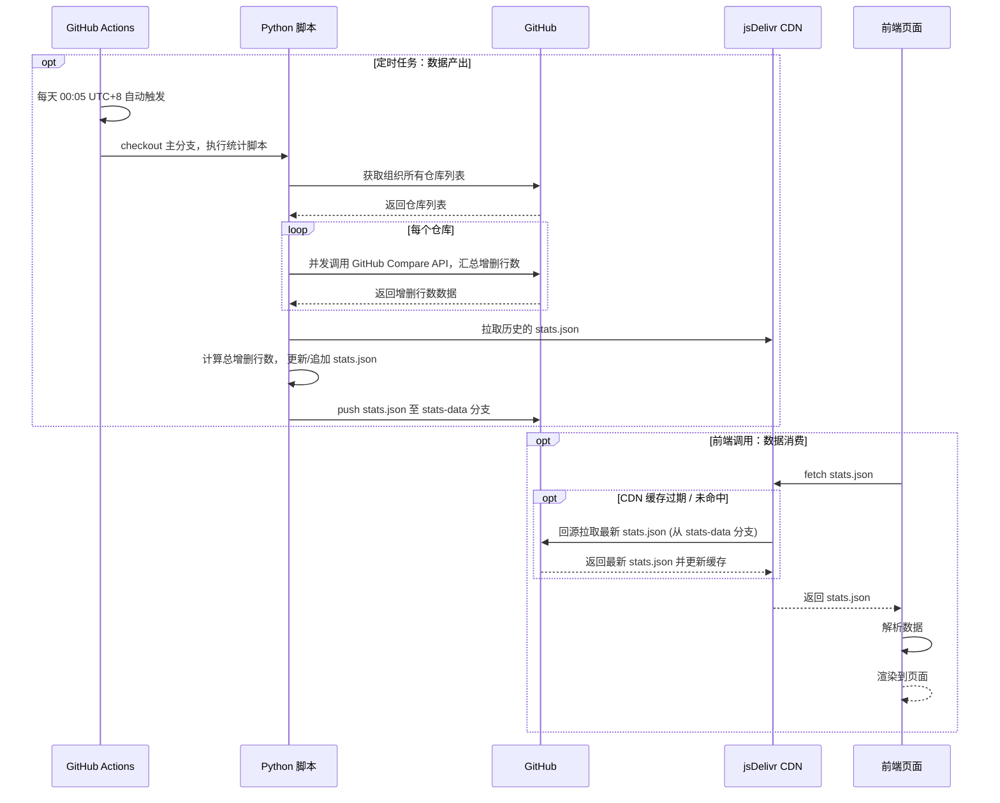
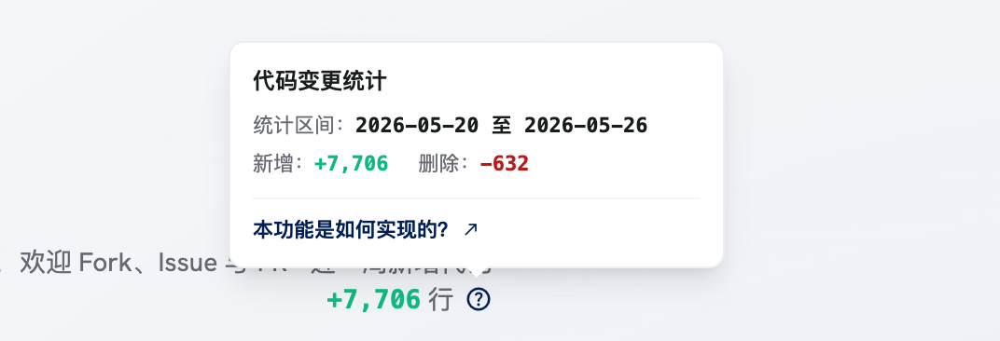

# Github 仓库如何统计代码变更行数

EMU-Stu 官网首页上「近一周新增代码 +XXXX 行」这行小字，背后其实有一套完整的自动化流水线。从每天凌晨自动跑脚本，到前端拿到数据展示出来，中间涉及 GitHub Actions、Python 脚本、独立数据分支和 jsDelivr CDN。这篇文章把整条链路拆开讲一遍。


## 整体链路

整套方案**零成本**，**不需要服务器**，**不需要数据库**。



## 数据从哪来

GitHub 的 REST API 提供了仓库级别的对比接口。给定两个 commit SHA，`/repos/{owner}/{repo}/compare/{base}...{head}` 会返回每个文件的增删行数。思路就是：**对组织下每个仓库，找到目标日期的头尾两个 commit，调 compare 接口拿差异，最后加总。**

难点在于「找头尾 commit」这件事。

一个仓库在目标日期之前可能一个 commit 都没有（刚建的仓库），也可能当天没有任何提交。脚本对这些边界情况做了处理：

- 当天之前有提交、当天也有提交 → 取两个时间点的 commit 做 compare
- 当天之前没有提交、当天有提交 → 这是个新仓库，先找到最早的 root commit，再和当天最后一个 commit 做 compare
- 当天没有任何提交 → 跳过，增删都是 0

## 认证

如果你是个人账号下的仓库，可以直接使用[个人 PAT](https://github.com/settings/personal-access-tokens)。

由于 EMU-Stu 是一个组织，使用个人 PAT 来访问组织下的仓库不太合理。所以，这里是通过给组织添加一个 Github APP，然后使用 APP 生成临时 token。具体使用的是：[actions/create-github-app-token](https://github.com/actions/create-github-app-token) 这个 action。

## 每天自动运行

GitHub Actions 的 `schedule` 触发器只认 UTC 时间。要在北京时间凌晨 00:05 跑，cron 表达式得写成 `5 16 * * *`（UTC 16:05 = 北京时间 00:05）。

Github Actions 的步骤上面时序图已经画得很清楚了，这里不再赘述。

> [!TIP]
> **Github Actions 的 schedule 不保证准确触发**。
> Action 会根据 Github 服务器资源情况排队触发，所以设置了 00:05 的触发时机，但是实际却是 1、2 点触发的情况很正常。 具体可以看 [Github 官网](https://docs.github.com/en/actions/using-workflows/events-that-trigger-workflows#schedule)。

## 数据存在哪

没有用数据库，也没用外部存储。`stats-data` 是仓库里的一个独立分支，里面只放一个文件 `stats.json`。

这么做的好处是：

- 不污染主分支的代码
- 数据文件可以通过 `raw.githubusercontent.com` 直接访问

`stats.json` 的结构很简单，就是一个数组，每个元素长这样：

```json
{
  "date": "2025-05-26",
  "total_additions": 1523,
  "total_deletions": 432,
  "repos": [
    { "name": "EMU-Stu-Site", "additions": 800, "deletions": 200 },
    { "name": "IoT-lab-web", "additions": 723, "deletions": 232 }
  ]
}
```

## CDN 作用是什么

其实只要用户的网络在霍格沃茨魔法学院修炼过，直接从 GitHub 拉也行，哈哈。

所以 CDN 的作用就是让**没有魔法学院网络连接的**用户也能正常 fetch 到数据，而不被墙。当然了，jsDelivr 偶尔也会抽风，但总体来说还行。

## 前端怎么展示

前端组件 `emu-projects` 在挂载时调用 `loadCommitStats()`，从 jsDelivr CDN 拉 `stats.json`：

```
https://cdn.jsdelivr.net/gh/EMU-Stu/EMU-Stu-Site@stats-data/stats.json
```

拿到数据后，按北京时间算出最近 7 天的日期列表，过滤出这 7 天的记录，把 `total_additions` 和 `total_deletions` 分别求和。

页面上只显示一行：「近一周新增代码 +X,XXX 行」。旁边有个问号图标，hover 上去会弹出 tooltip，展示完整的统计区间、新增数（绿色）和删除数（红色），还带了一个链接指向这篇文章。



